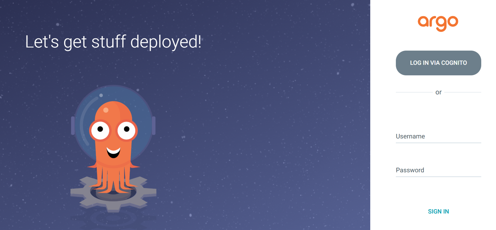
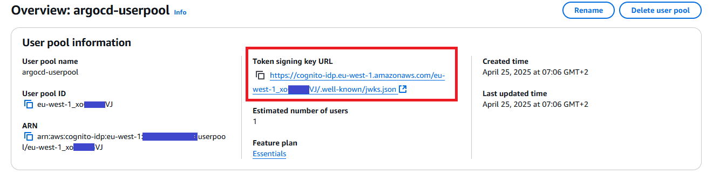
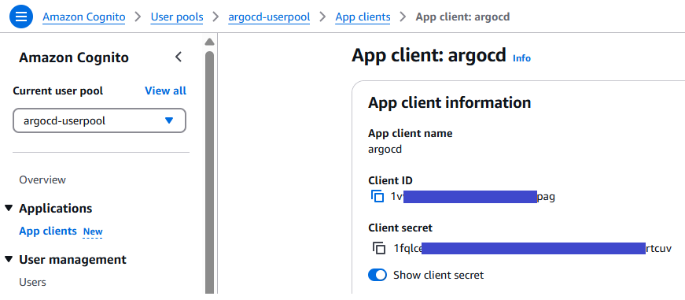
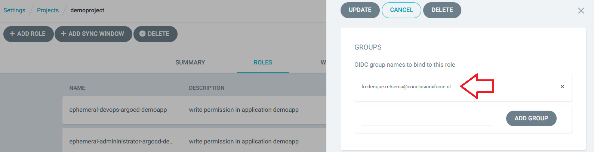
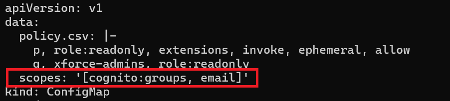
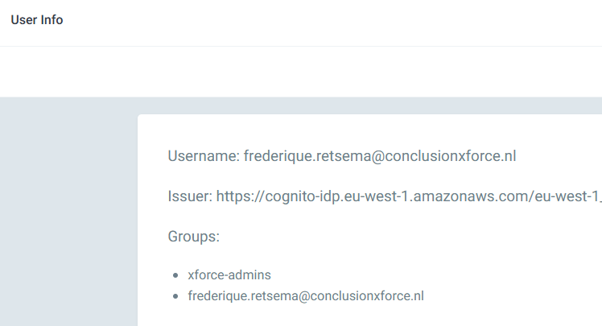
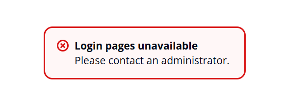
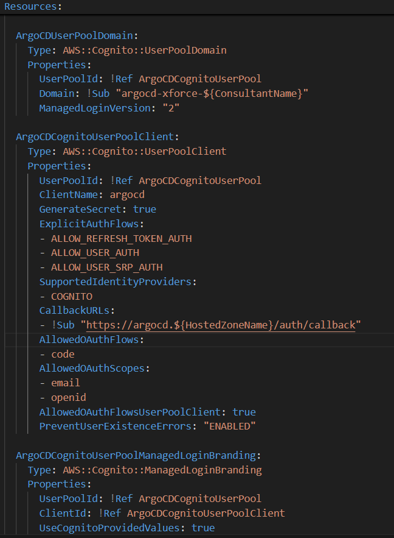

# ArgoCD Single Sign On based on AWS Cognito Userpools

## Introduction
In this blog, I will show how you can connect ArgoCD and AWS Cognito via OIDC. It took me some time to figure out how to configure AWS CloudFormation and how to let AWS Cognito and ArgoCD work together. You can use this GitHub repository for a reference when you are struggeling yourself [1].

## AWS Cognito
AWS Cognito is an identity provider based on OIDC. It can create, update and delete users and groups in user pools and store application data like secrets that give read permissions within the user pool. Cognito can also connect to other identity providers like Facebook, Google, Amazon, X and any OIDC or SAML provider.  You can also configure guest access if you need to. 

In this example I will keep it simple: I will create one user in one administrator group in an AWS Cognito user pool and then connect that user pool to ArgoCD.

## ArgoCD
ArgoCD is a tool to connect Git repositories to Kubernetes. Any change in the Git repository will be deployed in the Kubernetes environment, this can be done both manually and automatically. ArgoCD can also be configured to revert drift: when a Kubernetes environment changes and the Git repository stays the same, ArgoCD can revert the changes in the live Kubernetes environment. ArgoCD is used in about half of the Kubernetes environments according to the maintainers of ArgoCD. 

There are two default roles in ArgoCD: readonly and administrator. In this demo my demo user in the AWS Cognito Userpool will by default be a read-only user. 

## ArgoCD Ephemeral Access Extension
In many cases, just using ArgoCD is enough for your environment. Sometimes, however, you want to have more control on the ArgoCD application. An example of this is that you might want to synchronize only with the Git repository when there is an approved change in, for example, Service Now. The ArgoCD part of this solution is already available: it is called the _Ephemeral Access Extension_. In the ArgoCD user interface you can request permissions that are assigned to one of the roles for your user group. When access is granted then you will have elevated privileges in ArgoCD for a limited time. The permissions, the names of the roles, the number of roles, the text that is shown when you select the role (and more) are all configurable. When the permission is granted (and without an extra plugin you will always be granted the permission), then an ArgoCD role is attached to the ArgoCD Project. For more information please look at the Github project of the Ephemeral Access Extension [2]. In this example I will use the Ephemeral Access Extension to show how OIDC works within ArgoCD.

## OIDC configuration within ArgoCD
There are two places where the OIDC is configured: it is configured in the config map argocd-cm (which describes the connection with AWS Cognito) and it is also configured in the config map argocd-rbac-cm (which describes the Role Based Access Control of the groups in ArgoCD). 

The argocd-cm config map looks like:

The __name__ is the name that you will see in the login screen of ArgoCD. It is not used in the communication with AWS Cognito.

The __issuer__ is the first part of the Token signing key URL in AWS Cognito: you have to skip the “.well-known/jwks.json” part.

You can find the __client ID__ and the __client secret__ by going to the App clients submenu in the Cognito Userpool. 

It is not possible to add the groups to the __requestedScopes__ in AWS Cognito, to get the groups we have to use the __requestedIDTokenClaims__ setting. More information about the way this should be configured for other OIDC providers can be found in the ArgoCD documentation [3].

The __redirectUrl__ is your argocd URL with prefix _/auth/callback_. Don’t forget to add the __url__-part just below the oidc.config definition. The information about the groups are retrieved using the GetInfo API call. This is configured by enabling the __getUserInfo__ parameter. When you forget to do so, you will get the error __Failed to query provider "ISSUER": Get "ISSUER/.well-known/openid-configuration": unsupported protocol scheme ""__ when click the Cognito button in ArgoCD.

## ArgoCD Ephemeral Access Extension
All people of an OIDC group can request a role when this is configured within the Ephemeral Access Extension, by clicking on the permission button. When the permissions are granted, the role is assigned to just the person who requests the role. This is done by assigning the role to the email address, not to the group.

To connect the email address of the user to his OpenID, the email address should be added to the scope of the RBAC configuration:

By doing this, you will see that a user has now an extra group in ArgoCD: the groups that were assigned within AWS Cognito and ones own email address.

## AWS CloudFormation
AWS CloudFormation can be used to deploy AWS resources using CloudFormation templates.
In this example I’m using AWS CloudFormation to deploy an AWS Cognito userpool with one user in one group. The template also deployes three EC2 nodes. I’m using cfn-init to put the configuration files in the /opt/xforce directory. Data from different resources is injected in these configuration files by a configuration script. This script also installs argocd and the argocd ephemeral access extension.

You can use this CloudFormation script yourself to deploy this example[1] to your own AWS environment. To use it, you first have to create an empty AWS S3 bucket with the name <consultant-name>-<profile-name> (f.e. frederique-xforce-sandbox1). Also the variables in the start-k8s.sh and stop-all-k8s.sh. You also need an certificate ID from AWS Certificate Manager, in my case I used a star certificate for __*.sandbox1.prutsforce.nl__.

## Configuring AWS Cognito in CloudFormation
It took me quite some time to configure AWS Cognito in the AWS CloudFormation template: when I tested the login page via Userpool > App client > View login page, I got an error message “Login pages unavailable, Please contact an administrator”. 

After a few hours I discovered that I forgot to add a __AWS::Cognito::ManagedLoginBranding__ resource. When I added this resource, the login page started working.

The user pool, user pool client and login branding resources are:

## Conclusion
It can take some time to configure OIDC in an application. In this example I showed how to use AWS Cognito as an OIDC provider for ArgoCD. I also wrote a CloudFormation template to get a working environment.

## Links
[1] Github repo: https://github.com/FrederiqueRetsema/ArgoCD-SSO-based-on-AWS-Cognito-Userpools   
[2] Ephemeral Access Extension repo: https://github.com/argoproj-labs/argocd-ephemeral-access    
[3] ArgoCD documentation about OIDC: https://argo-cd.readthedocs.io/en/stable/operator-manual/user-management/    
